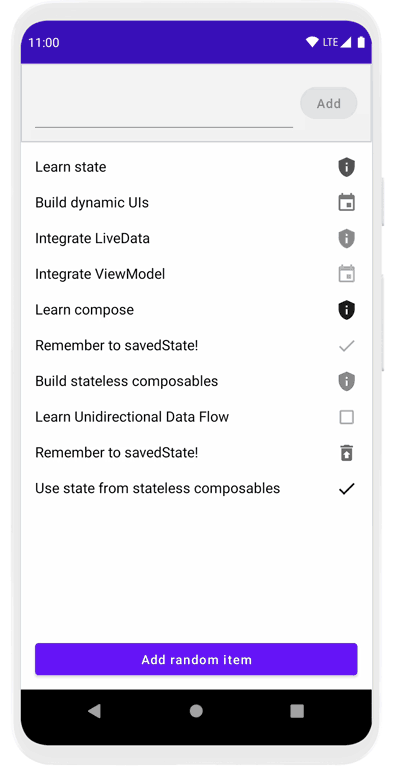

# About this project
this project is a copy of google code lab from: https://developer.android.com/codelabs/jetpack-compose-state#0

This project codes are updated and modified by the author of this project. 

## Folders
* `app` folder is the playground folder of the author learning from this codelab
* `start` folder is the original scaffold module to start coding this codelab
* `finished` contains sample solution of the codelab

## Learning progress

* https://developer.android.com/codelabs/jetpack-compose-state#7

## Unidirectional data flow in the android view system
Unidirectional data flow is a design where state flows down and events flow up.

The advantages of using unidirectional data flow:

1. Testability – by decoupling state from the UI that displays it, it's easier to test both the ViewModel and the Activity
2. State encapsulation – because state can only be updated in one place (the ViewModel), it's less likely that you'll introduce a partial state update bug as your UI grows
3. UI consistency – all state updates are immediately reflected in the UI by the use of observable state holders

Reference: 
* https://developer.android.com/codelabs/jetpack-compose-state#2

# Using State in Jetpack Compose Codelab

This folder contains the source code for the [Using State in Jetpack Compose codelab](https://developer.android.com/codelabs/jetpack-compose-state).

In this codelab, you will explore patterns for working with state in a declarative world by building a Todo application. We'll see what unidirectional
data flow is, and how to apply it in a Jetpack Compose application to build stateless and stateful composables.

# Note to extract composable UI part
1. In `TodoScreeen.kt` file select the `UI part ( Column statement, not the val statements)` , then `right mouse click -> refactor -> function`
2. Follow the instruction on https://developer.android.com/codelabs/jetpack-compose-state#7

Reference:
* https://www.jetbrains.com/help/idea/extract-method.html


## Screenshots



## License

```
Copyright 2020 The Android Open Source Project

Licensed under the Apache License, Version 2.0 (the "License");
you may not use this file except in compliance with the License.
You may obtain a copy of the License at

    https://www.apache.org/licenses/LICENSE-2.0

Unless required by applicable law or agreed to in writing, software
distributed under the License is distributed on an "AS IS" BASIS,
WITHOUT WARRANTIES OR CONDITIONS OF ANY KIND, either express or implied.
See the License for the specific language governing permissions and
limitations under the License.
```
